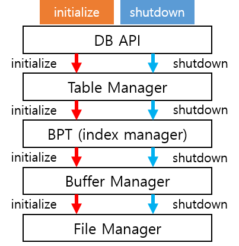

# Buffer Manager Implementation

## A. Buffer Manager
### a. LRU Policy
  
  
Doubly linked list를 이용해 LRU policy를 구현했다. page를 buffer manager에게 요청하면 그에 해당하는 buffer block의 link를 끊고 tail에 insert한다. 따라서 최근 요청된 buffer block일수록 linked list의 tail쪽에 위치하고, 마지막 요청이 오래전일수록 head쪽에 위치하게 된다. 따라서 eviction이 일어날 때는 head부터 victim을 찾는다.

### b. Buffer Block Architecture
  

Buffer manager 내부에서 `page_t`를 담는 array를 만들고 buffer block에서 이를 pointing하는 방식으로 구현했다. 또한 pin된 횟수를 저장하도록 하였다. 

**<비고>**  
mutli threading이 필요할 때는 buffer block의 `pin_count` field를 `std::atomic<int>` 타입으로 바꾸는 것을 고려해야한다.

### c. Searching Buffer with HashTable
이미 buffer manager에 load된 page에 대해 다시 요청이 온 경우 file io를 발생할 필요 없이 바로 해당 block을 불러오면 된다. 이때 해당 블록을 빠르게 찾기 위하여 c++의 hash table 컨테이너인 `std::unordered_map`을 사용했다.

### d. Page API & Pin Management
기존의 page API로는 pin count를 완벽하게 관리하는 것이 힘들었다. 따라서 이번 project에서 page API를 개편했다.

#### 1. Modified Page wrapper
요청된 page에 대한 buffer block이 결정된다면 buffer manager가 해당 block의 주소를 넣어 `Page` 클래스의 인스턴스를 생성하는 방식으로 구현하였다. 기존에 `page_t` 인스턴스를 `Page` 클래스가 가지고 있는 방식에서 `BufferBlock`에 있는 `page_t` 인스턴스를 이용하도록 수정되었다.

**<비고>**  
다수의 thread가 같은 buffer block을 가지고 있을 수 있다. 따라서 이 경우 race condition이 발생할 우려가 있는데. 추후 `BufferBlock`마다 mutex를 갖게 하여 수정하는 것을 고려해야한다.

#### 2. Pin management
생성된 곳과 파괴하는 곳은 같아야 한다는 원칙에 따라 pin count의 관리를 전부 buffer manager 선에서 할 수 있도록 설계했다. Pin count를 올리는 곳은 `BufferManager`의 `get_page` 메소드이다. Pin count를 내리는 것은 `Page` 클래스에 RAII (Resource Acquisition Is Initialization) 패턴을 적용해 `Page` 클래스가 파괴되면 pin count가 내려가도록 했다. 이는 `get_page`에서 pin count를 올리며 `Page` 인스턴스가 생성되기 때문에 `Page`가 파괴되는 시점에 pin count를 내리는 것이 자연스럽기 때문이다. 또한 `Page` 인스턴스에 대한 scope를 더욱 정밀하게 표현하기 위해 `buffer`라는 함수를 만들어 lambda expression을 받아 처리할 수 있게 하였다.

pin을 하는 시점은 선제적 방식과 필요할 때마다 하는 방식 중 후자를 채택했다.
이러한 방식을 채택함으로써 이후 multi threading에서 buffer manager에 unpinned buffer block이 없어 다수의 worker가 대기하는 상황을 최소화 할 수 있을 것이다.
또한 4개 이상의 버퍼 크기에서는 완전히 동작하게 돼 memory가 작은 system에서도 돌아갈 수 있다.
하지만 잦은 unpin으로 다수의 worker가 존재할 경우 eviction이 많이 발생할 우려가 있는데, 이는 추후 multi threading을 지원하면서 테스트 할 필요가 있다.

## B. Multi Table Supporting
이번 project부터 다수의 table을 열고 닫는 기능이 추가됐다.
이를 지원하기 위해 각 table을 표현할 `Table` 데이터형을 추가했다. 또한 이를 관리하는 `TableManager` 또한 추가했다.
각 `Table`엔 table의 filename, id 그리고 FileManager의 `File`을 담는다.

## C. Layer Architecture
### a. initialize, shutdown
  
initialize와 shutdown은 layer architecture의 계층을 따라 각 layer의 initialize / shutdown 메소드를 서로가 호출하는 방식으로 동작한다.

### b. open / close table
table을 open하는 것은 DB API에서 table id 가지고 TableManager에게 요청을 하면 그에 상응하는 `Table` 인스턴스를 가져와 하위 layer에선 전부 `Table`에 담긴 정보를 바탕으로 동작을 수행한다.

### c. new page allocation
Page의 수정은 buffer manager에서 동작하니 file manager에서 새로운 page를 alloc 하는 작업을 할 때 header page의 sync를 맞출 수 없다. 따라서 이를 수정하기 위해 `BufferManager`에 `create_page`와 `free_page`를 만들고 db file 자체를 수정하는 부분은 전부 `FileManager`에서 담당하고 그 외 `Page`의 수정은 `BufferManager`에서 하도록 수정했다.
